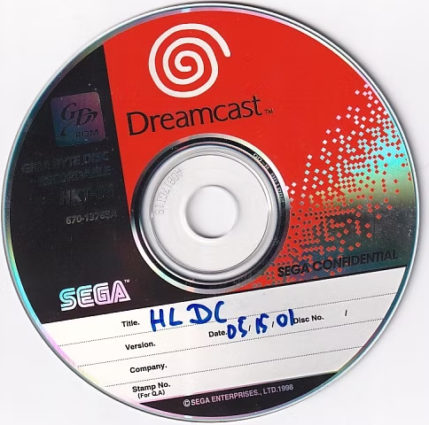
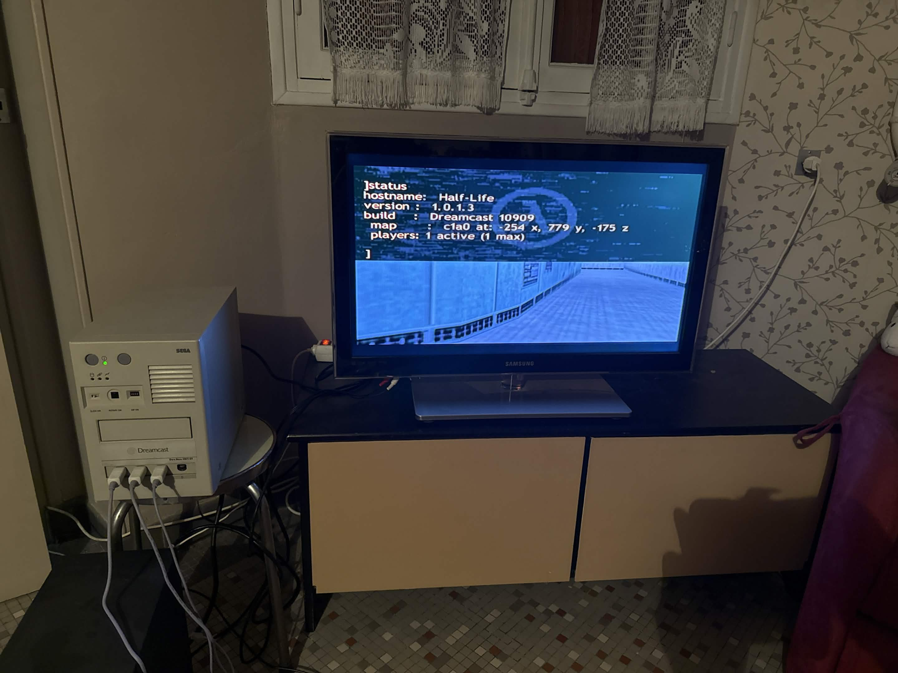
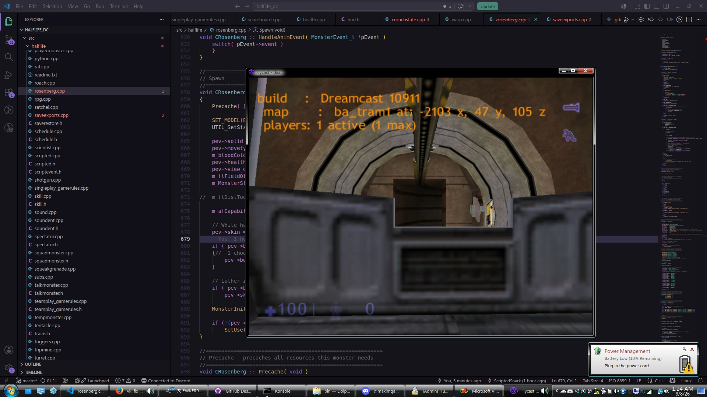

# HALFLIFE_DC 

Reverse-engineered source code of the Half-Life 1 Dreamcast port — engine build **1659**,
compiled on **10 May 2001**, a month before Sierra cancelled the project.

The build was published by [Sega Dreamcast Info](https://www.sega-dreamcast-info.com/en/half-life-dreamcast-unreleased-sega)
and later reverse-engineered by our team.

| | |
|---|---|
|  |  |
| Rebuilt engine on a Dev.Box HKT-01 | …and the same disc under Flycast |

This repository contains:
- Restored source code of HL SDK
	- [x] client.lib
	- [x] halflife.lib
- Restored source code of the engine
	- [x] halflife_dc.exe

The game links all of its libraries statically, so one binary is the whole thing.

---

## Getting started

Before building the project, you need to install:

- **Microsoft Visual C++ 6.0**
- **Windows CE SDK 2.1 for Sega Dreamcast (Dragon SDK)**

## Building

### Visual C++ 6.0

Open the workspace at `projects\halflife_dc.dsw` and press `Build` -> `Build halflife_dc.exe`.
`client`, `halflife` and `zlib` come along as dependencies.

To get a disc rather than an executable, point `GDISRC` in `postbuild_dc.bat` at your copy of
the prototype GDI. The post-build step overlays the fresh `HALFLIFE_DC.EXE` and `0WINCEOS.BIN`
onto a copy of it and writes a bootable image; without `GDISRC` it is skipped.

## Required files for playing

You will need the original data files from
[Half-Life Dreamcast (May 15, 2001 prototype)](https://eb8ac358-870e-4729-89d2-b3440978e745.filesusr.com/archives/002b71_57f5b25634064abd88b7ba3e2bb92b09.7z?dn=Half-Life%20(May%2015,%202001%20prototype).7z).

## Tools

`utils/` carries the SDK utilities the port was built with, supporting the Dreamcast's native
formats (PVR). `utils\build_tools.bat` builds them into `utils\build\`.

- **studiomdl** — studio models, with PVR skins and the compressed Neo model format.
- **qlumpy** — level wads, with PVR textures.
- **makels** — cuts a level's textures into the ~128K wad pieces the engine swaps in and out.

See [`utils/README.md`](utils/README.md) for the details.

## Multiplayer

The prototype has multiplayer cut out of it. We put it back.

It sits behind `HLDC_MP` in [`src/util/dreamcast_crt.h`](src/util/dreamcast_crt.h), which is `0`
by default so that a plain build still matches the binary we are diffing against:

```c
#define HLDC_MP 1
```

Set it to `1` and you get the restored netstack and multiplayer functionality, plus the
front-end that comes with it — extra menu pages, a server browser and an on-screen chat
keyboard.

There is a second switch in the same header, `HLDC_FIXES`, covering the places where the
released game is simply wrong. It is `0` too, so the engine reproduces the original bugs:

```c
#define HLDC_FIXES 1
```

Set it to `1` for a corrected engine. Every guarded site names the symptom it produces in the
game, so a single fix can be turned off again while tracking down a difference in behaviour.

## Media

More in [`media/`](media/) — including the disc being burned out of Visual C++ 6.00 through
GDWorkshop onto a Katana dev kit unit, which is roughly how this looked in 2001.

## People involved in development of the project

- [maximqad](https://github.com/maximqaxd) — [Boosty](https://boosty.to/maximqad)
- [ScriptedSnark](https://github.com/ScriptedSnark/) — [Boosty](https://boosty.to/scriptedsnark), [Patreon](https://patreon.com/ScriptedSnark)

## Referenced projects

- [half-life1_win32_722](https://github.com/ScriptedSnark/half-life1_win32_722)
- [Half-Life SDK 1.0](https://github.com/ScriptedSnark/hlsdk-versions/tree/hlsdk_sp_1_0)
- HLDS Linux binaries

## Special thanks

- [Sega Dreamcast Info](https://www.sega-dreamcast-info.com/en/half-life-dreamcast-unreleased-sega) (for releasing the prototype)
- [Sizious](https://github.com/sizious) (for playtesting)
